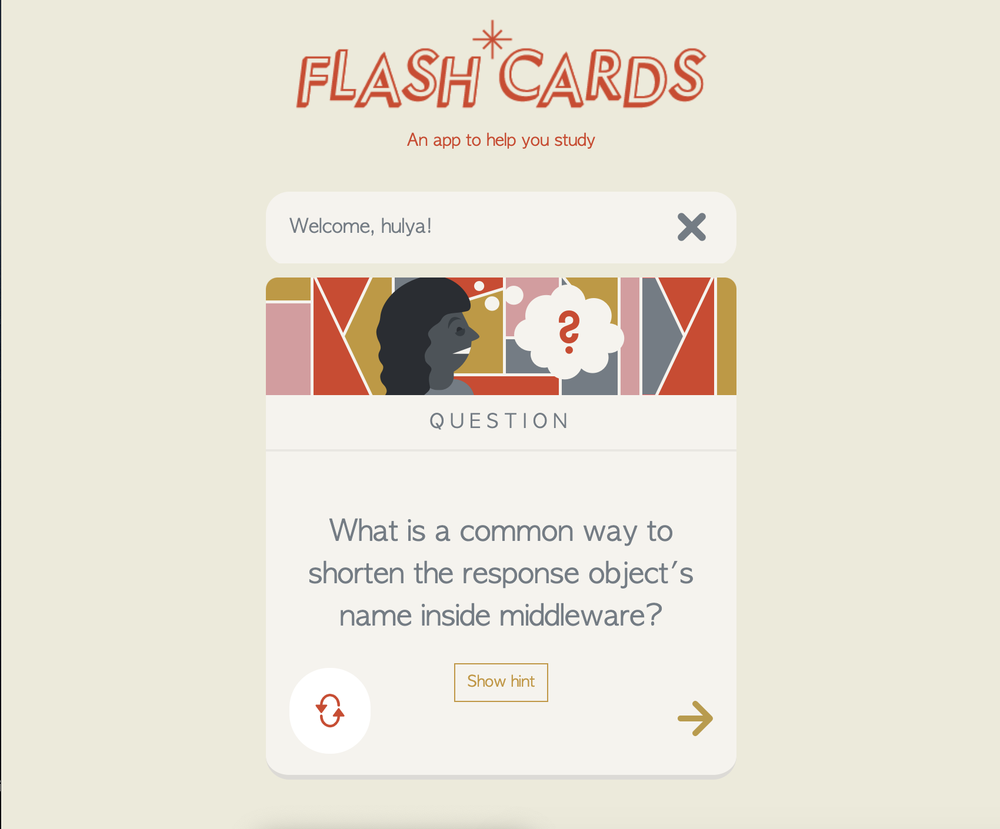

# Flashcards app

The app accepts the name of the user and it greets them. From the homepage you can launch a flash card study session, the app will give you flash cards in a random order.
You can flip them front to back and back again.
Clicking Next shows the next card.
Finally, a user can clear their name from the side bhy clicking the X symbol.



## Installation

```bash
npm install

npm start
```